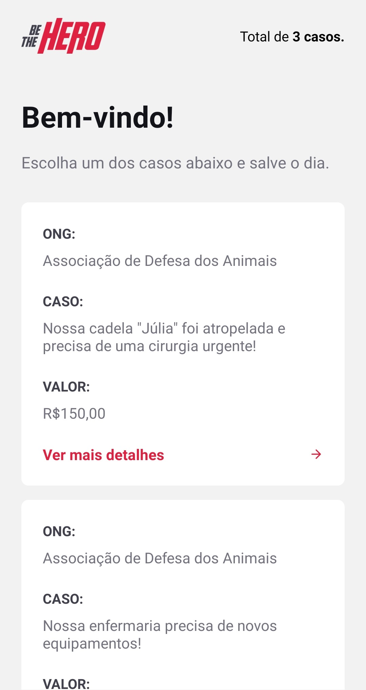
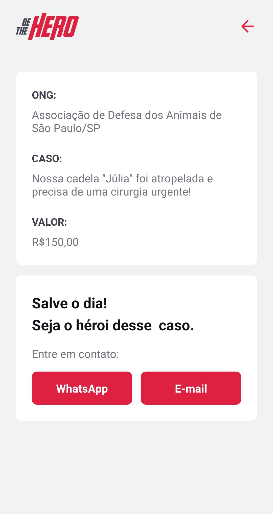

# Semana Omnistack 11 - Be The Hero
An application to help nonprofit organizations to achieve their goals.
# Technologies Used
- Node.js
- React JS
- React Native
# Running
## Back-end
```
npm install
npx knex migrate:latest --env development
npm run start
```
Back-end runs at port 3333.
## Front-end
Edit `src/services/api.js` and add your back-end URL.
```
import axios from 'axios';

const api = axios.create({
  baseURL: 'http://localhost:3333',
});

export default api;
```
Install dependencies and run:
```
yarn
yarn run start
```
## Mobile
Edit `src/services/config.js` and add your back-end URL.
```
import axios from 'axios';

const api = axios.create({
  baseURL: 'http://127.0.0.1:3333',
});

export default api;
```
Install dependencies and run:
```
yarn
yarn run start
```
Metro Bundler will open with your run options.
# Screenshots
## Web
</img>

</img>
## Mobile
</img>
</img>
